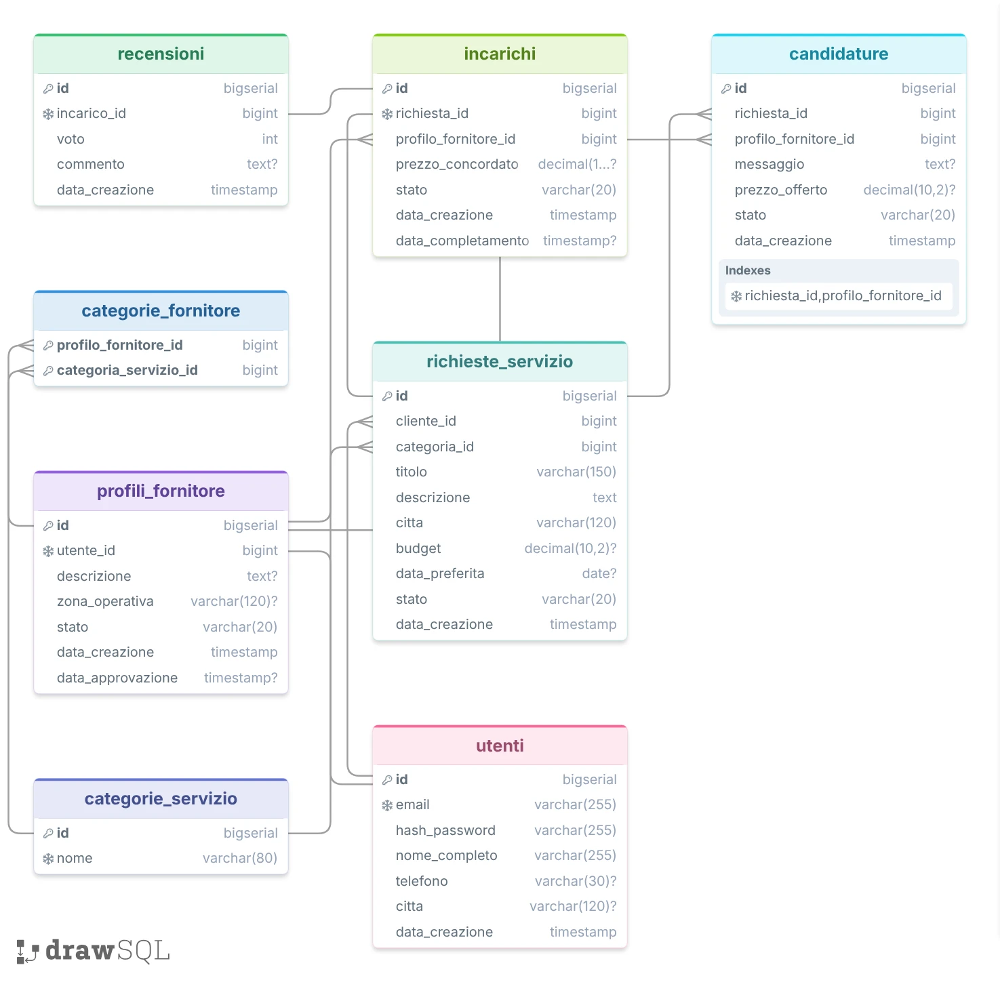

# Tasky

Web app mobile first per mettere in contatto chi cerca piccoli servizi pratici con chi vuole offrirli:
lavori domestici, manutenzioni, giardinaggio, montaggi, pulizie e assistenza pratica.

Esiste un solo tipo di account. Lo stesso utente agisce da cliente quando pubblica una richiesta,
e da fornitore quando si candida — ma solo dopo aver completato la verifica.

## Stack

| Parte | Tecnologie |
|---|---|
| Frontend | React, React Router, Tailwind CSS, Vite |
| Backend | Java 25, Spring Boot, Spring Security + JWT, JPA/Hibernate |
| Database | PostgreSQL |
| Build | Maven (backend), npm (frontend) |

## Struttura

```
Tasky/
├── backend/             API REST in Spring Boot
├── frontend/            applicazione React (da creare)
├── docs/                diagrammi
└── docker-compose.yml   PostgreSQL per lo sviluppo
```

## Modello dati

Otto tabelle. Diagramma completo su [drawSQL](https://drawsql.app/teams/alessandro-nappa/diagrams/tasky),
esportato anche in [docs/modello-dati.webp](docs/modello-dati.webp).


