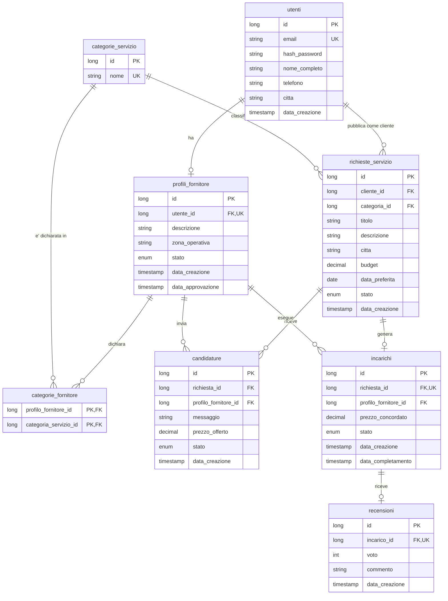

# Tasky

Web app mobile first per mettere in contatto chi cerca piccoli servizi pratici con chi vuole offrirli:
lavori domestici, manutenzioni, giardinaggio, montaggi, pulizie e assistenza pratica.

Esiste un solo tipo di account. Lo stesso utente agisce da cliente quando pubblica una richiesta,
e da fornitore quando si candida — ma solo dopo aver completato la verifica.

## Stack

| Parte | Tecnologie |
|---|---|
| Frontend | React, React Router, Tailwind CSS, Vite |
| Backend | Java 25, Spring Boot, Spring Security + JWT, JPA/Hibernate |
| Database | PostgreSQL |
| Build | Maven (backend), npm (frontend) |

## Struttura

```
Tasky/
├── backend/             API REST in Spring Boot
├── frontend/            applicazione React (da creare)
├── docs/                diagrammi
└── docker-compose.yml   PostgreSQL per lo sviluppo
```

## Avvio in sviluppo

Il database gira in Docker sulla porta **5433**, per non entrare in conflitto con
eventuali PostgreSQL già installati sulla 5432.

```bash
docker compose up -d
```

```bash
cd backend && mvn spring-boot:run
```

Il backend risponde su `http://localhost:8080`.

## Flusso principale

1. L'utente si registra e accede
2. Come cliente pubblica una richiesta di servizio
3. Può chiedere l'attivazione come fornitore
4. Una volta approvato, si candida alle richieste
5. Il cliente consulta le candidature e sceglie un fornitore
6. Nasce l'incarico, che il fornitore porta avanti aggiornandone lo stato
7. A lavoro concluso il cliente lascia una recensione

## Modello dati

Otto tabelle. Diagramma completo su [drawSQL](https://drawsql.app/teams/alessandro-nappa/diagrams/tasky),
esportato anche in [docs/modello-dati.webp](docs/modello-dati.webp).




### Stati

| Entità | Valori |
|---|---|
| Profilo fornitore | `IN_ATTESA` · `APPROVATO` · `RIFIUTATO` |
| Richiesta | `APERTA` · `ASSEGNATA` · `COMPLETATA` · `ANNULLATA` |
| Candidatura | `IN_ATTESA` · `ACCETTATA` · `RIFIUTATA` |
| Incarico | `ASSEGNATO` · `IN_CORSO` · `COMPLETATO` · `ANNULLATO` |

Sul database gli stati sono `varchar(20)`: il vincolo sui valori ammessi lo tengono gli enum Java.

## Fuori scope

Pagamenti online, pannello di amministrazione, chat in tempo reale, notifiche push,
geolocalizzazione avanzata, algoritmi di matching, analytics e multilingua.

## Stato

Progetto appena avviato. Al momento è definito il modello dati; struttura del codice e
implementazione arrivano nei passi successivi.
